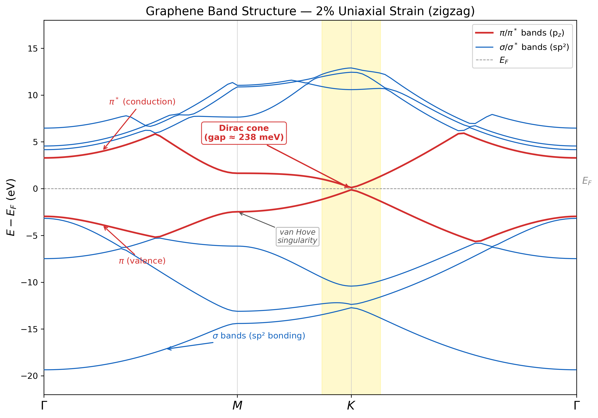

# Graphene under Uniaxial Strain: How Robust Is the Dirac Cone under uniaxial strain?

A first-principles DFT study using Quantum ESPRESSO (PBE) to investigate how the electronic structure of graphene — specifically the Dirac cone — responds to uniaxial tensile strain along the zigzag direction.

---

## Objectives

- Apply uniaxial strain (0%, 2%, 4%) to the graphene lattice along the zigzag direction
- Perform structural relaxation under each strain level to find internal atomic equilibrium
- Compute band structures along the Γ → M → K → Γ high-symmetry path
- Track the Dirac cone at the K point and determine whether it survives, shifts, or gaps out

---

## Background

### The Dirac Cone in Graphene

Graphene's remarkable electronic properties originate from a single feature in its band structure: at the K and K' corners of the hexagonal Brillouin zone, the π (valence) and π* (conduction) bands meet with linear dispersion:

E(k) ≈ ±ℏv_F|k − K|

This linear crossing — the Dirac cone — makes graphene a zero-gap semimetal where charge carriers behave as massless Dirac fermions with Fermi velocity v_F ≈ 10⁶ m/s.

### Why Strain?

Uniaxial strain modifies the nearest-neighbor hopping parameters unequally, breaking the C₃ rotational symmetry of the honeycomb lattice. The question is whether this is enough to destroy the Dirac cone. Tight-binding theory predicts the cone is topologically protected up to ~20% strain, beyond which the Dirac points at K and K' merge and a gap opens. This project tests that prediction from first principles.

---

## Methodology

### 1. SCF — Ground State

Solved the Kohn-Sham equations self-consistently to obtain the ground-state charge density ρ(r) and total energy.

Ĥ_KS ψ_i = ε_i ψ_i

Key settings: ecutwfc = 80 Ry, ecutrho = 640 Ry, 24×24×1 k-grid, Marzari-Vanderbilt smearing (degauss = 0.02 Ry), vacuum spacing = 15 Å.

---

### 2. Convergence Studies

Verified that results are independent of numerical parameters:

- **k-point convergence**: total energy converged within 1 meV at 24×24×1
- **Cutoff convergence**: total energy converged within 1 meV at ecutwfc = 80 Ry

---

### 3. Strain Application

Uniaxial tensile strain applied along the zigzag (x) direction by scaling the a₁ lattice vector:

- 0%: a₁x = 2.460 Å (unstrained)
- 2%: a₁x = 2.460 × 1.02 = 2.509 Å
- 4%: a₁x = 2.460 × 1.04 = 2.558 Å

Switched from ibrav=4 to ibrav=0 with explicit CELL_PARAMETERS to accommodate the symmetry-breaking deformation. The vacuum layer (15 Å) and a₂y component were kept unchanged.

---

### 4. Structural Relaxation (relax)

For each strained cell, relaxed atomic positions at fixed cell to find internal equilibrium:

E = E({R_i}) at fixed cell → minimize until F_i = -∂E/∂R_i ≈ 0

Key difference from vc-relax: the cell is deliberately frozen — strain is the independent variable, not something to be optimized away.

Results:

| Strain | BFGS Steps | Final Force (Ry/Bohr) | Sublattice Shift |
|--------|------------|----------------------|------------------|
| 0%     | — (by symmetry) | — | none |
| 2%     | 5          | 0.000011             | ~0.001 crystal units |
| 4%     | 5          | 0.000002             | ~0.001 crystal units |

The sublattice shifts are small but nonzero — confirming that internal relaxation matters, and that simply stretching the cell without relaxing would introduce systematic error.

---

### 5. Band Structure

Two-step process at each strain level:

1. **Charge density** — from SCF (0%) or reused from relaxation (2%, 4%)
2. **Non-SCF bands** — `calculation = 'bands'` along Γ → M → K → Γ with 40 k-points per segment

Post-processed with `bands.x` to extract plottable E(k) data.

---

## Results

### Band Structure — Individual Plots

#### 0% (Unstrained)


*Pristine graphene. The π and π* bands (red) meet exactly at K with zero gap — the Dirac cone is intact. The σ bands (blue, sp² bonding) lie well away from E_F.*

#### 2% Uniaxial Strain



*Under 2% strain, the Dirac cone survives. The apparent gap of ~238 meV at K is a numerical artifact from finite k-sampling — the true crossing has shifted slightly off the high-symmetry path due to broken C₃ symmetry.*

#### 4% Uniaxial Strain


*At 4% strain, the cone persists with an apparent gap of ~479 meV. The linear dispersion near K is preserved, indicating the Dirac point has shifted further in k-space but has not gapped out.*

---

### Comparison Panel


*Side-by-side comparison of all three strain levels. The Dirac cone (highlighted in yellow) progressively shows a larger apparent gap at K as strain increases, consistent with the crossing point migrating away from the nominal K.*

---

### Strain–Energy Relationship

| Strain | Total Energy (Ry) | ΔE from 0% (mRy) | Fermi Energy (eV) | Gap at K (meV) |
|--------|-------------------|-------------------|--------------------|----------------|
| 0%     | -36.8871          | 0                 | -1.659             | 0              |
| 2%     | -36.8867          | +0.4              | -1.800             | 238            |
| 4%     | -36.8850          | +2.1              | -2.015             | 479            |

---

## Physical Interpretation

**The Dirac cone is robust under moderate uniaxial strain.**

The apparent gap at K grows roughly linearly with strain (0 → 238 → 479 meV), but this does not indicate a true gap opening. The band dispersion near the crossing remains linear (not parabolic), which means the Dirac point has shifted in k-space away from the nominal K point rather than being destroyed.

This is consistent with tight-binding predictions: uniaxial strain modifies the three hopping parameters unequally, causing the Dirac point to drift in the Brillouin zone while maintaining the linear crossing. A true gap opening would require strains of ~20%+ to merge the K and K' Dirac points — far beyond the range studied here.

The energy cost of strain increases quadratically (0.4 mRy at 2%, 2.1 mRy at 4%), consistent with the harmonic elastic regime. The Fermi energy shifts downward with strain, reflecting changes in the average potential as C-C bonds elongate.

---

## Remarks

- The reported gaps are upper bounds — the actual crossing likely occurs slightly off the high-symmetry path
- A 2D k-grid scan around K would locate the exact Dirac point position under strain
- forc_conv_thr = 1.0×10⁻⁴ Ry/Bohr was used for relaxation, appropriate for 2D systems
- lsym = .false. was required in bands.x for the unstrained case to avoid a segfault (known QE issue with ibrav=0 and full hexagonal symmetry)
- All strained cases used ibrav=0 with explicit CELL_PARAMETERS to accommodate the broken hexagonal symmetry

---

## Project Structure

```
graphene-strain-qe-dft/
├── inputs/          ← QE input files (SCF, relax, bands, post-processing)
├── outputs/         ← raw QE output files
├── dft_data/        ← band data files (.gnu, .dat etc.), convergence data
├── pseudo/          ← pseudopotentials (C.pbe-n-kjpaw_psl.1.0.0.UPF)
├── results/         ← plots and figures
│   ├── bands_strain_0p00.png
│   ├── bands_strain_0p02.png
│   ├── bands_strain_0p04.png
│   └── bands_comparison.png
├── scripts/         ← Python plotting scripts
├── tmp/             ← QE working directory (not tracked)
└── README.md
```

---

## Tools Used

- Quantum ESPRESSO (pw.x, bands.x)
- Python (NumPy, Matplotlib)
- Bash utilities
- WSL (Windows Subsystem for Linux)

---

## Key Learnings

- Uniaxial strain requires ibrav=0 with explicit CELL_PARAMETERS — ibrav=4 assumes hexagonal symmetry
- Internal relaxation under strain is necessary even when sublattice shifts are small (~0.001 crystal units)
- The K point in crystal_b coordinates depends on the orientation of CELL_PARAMETERS — (1/3, 1/3, 0) vs (1/3, 2/3, 0) maps to different physical points
- bands.x with lsym=.false. avoids symmetry-related crashes but disables band connectivity tracking — nbnd should be kept small (8 for graphene) to avoid spaghetti
- The charge density from a relaxation run can be reused directly for band structure calculations via matching prefix

---

## Possible Extensions

- Finer strain grid (0%, 1%, 2%, ..., 10%) to map the gap-vs-strain curve
- 2D k-grid scan around K to locate the exact Dirac point under strain
- Armchair strain direction for comparison — different hopping modification pattern
- Biaxial strain — preserves C₃ symmetry, Dirac cone should remain at K
- GW corrections to check if many-body effects modify the strain response

---

**Md. Saidul Islam**
