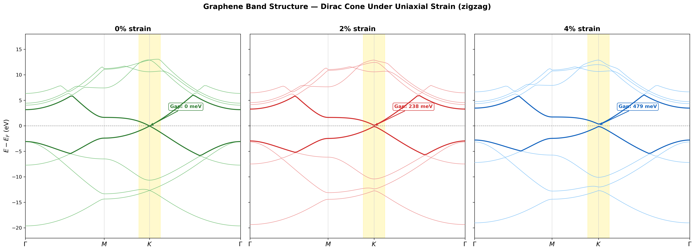
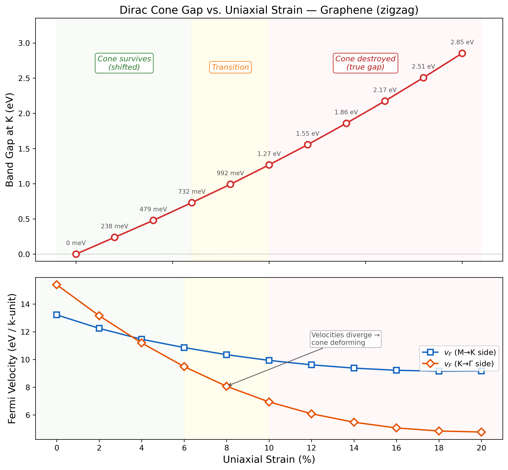
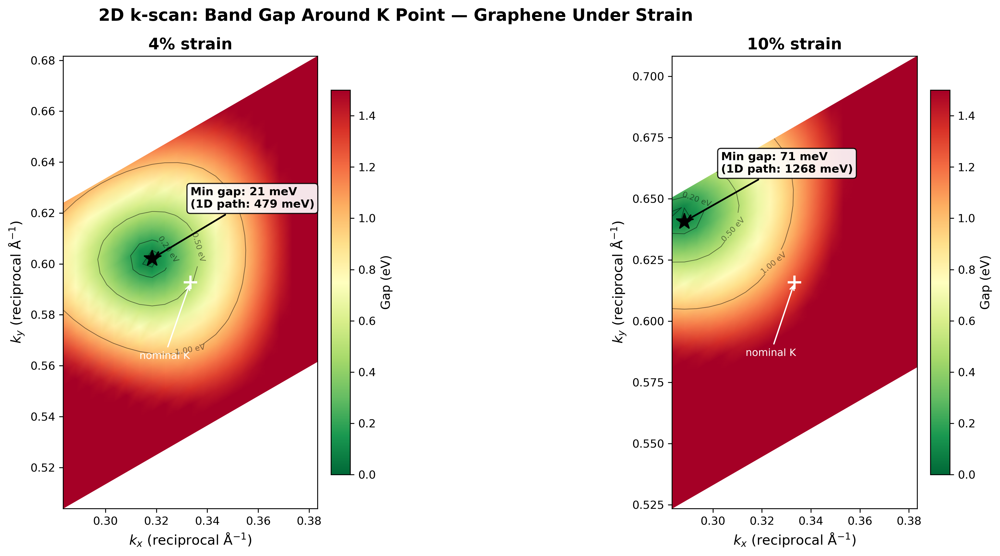

# Graphene under Uniaxial Strain: How Robust Is the Dirac Cone?

A first-principles DFT study using Quantum ESPRESSO (PBE) to investigate how the electronic structure of graphene — specifically the Dirac cone — responds to uniaxial tensile strain along the zigzag direction, from 0% to 20%.

---

## Objectives

- Apply uniaxial strain (0–20%) to the graphene lattice along the zigzag direction
- Perform structural relaxation under each strain level to find internal atomic equilibrium
- Compute band structures along the Γ → M → K → Γ i.e., the high-symmetry path in Graphene
- Track the Dirac cone at the K point and determine whether it survives, shifts, or gaps out
- Identify the critical strain regime where the Dirac cone is destroyed using a Fermi velocity diagnostic
- Confirm results with 2D k-scans around K to locate the actual Dirac point position

---

## Background

### The Dirac Cone in Graphene

Graphene's remarkable electronic properties originate from a single feature in its band structure: at the K and K' corners of the hexagonal Brillouin zone, the π (valence) and π* (conduction) bands meet with linear dispersion:

E(k) ≈ ±ℏv_F|k − K|

This linear crossing — the Dirac cone — makes graphene a zero-gap semimetal where charge carriers behave as massless Dirac fermions with Fermi velocity v_F ≈ 10⁶ m/s.

### Why Strain?

Uniaxial strain modifies the nearest-neighbor hopping parameters unequally, breaking the C₃ rotational symmetry of the honeycomb lattice. The question is whether this is enough to destroy the Dirac cone. Tight-binding theory predicts the cone is topologically protected up to ~20% strain, beyond which the Dirac points at K and K' merge and a gap opens. This project tests that prediction from first principles.

---

## Methodology

### 1. SCF — Ground State

Solved the Kohn-Sham equations self-consistently to obtain the ground-state charge density ρ(r) and total energy.

Ĥ_KS ψ_i = ε_i ψ_i

Key settings: ecutwfc = 80 Ry, ecutrho = 640 Ry, 24×24×1 k-grid, Marzari-Vanderbilt smearing (degauss = 0.02 Ry), vacuum spacing = 15 Å.

---

### 2. Convergence Studies

Verified that results are independent of numerical parameters:

- **k-point convergence**: total energy converged within 1 meV at 24×24×1
- **Cutoff convergence**: total energy converged within 1 meV at ecutwfc = 80 Ry

---

### 3. Strain Application

Uniaxial tensile strain applied along the zigzag (x) direction by scaling the a₁ lattice vector:

a₁x(ε) = 2.460 × (1 + ε) Å

Strain levels: 0%, 2%, 4%, 6%, 8%, 10%, 12%, 14%, 16%, 18%, 20%.

Switched from ibrav=4 to ibrav=0 with explicit CELL_PARAMETERS to accommodate the symmetry-breaking deformation. The vacuum layer (15 Å) and a₂ vector were kept unchanged — pure uniaxial strain with no Poisson relaxation, relevant to the nanowire limit.

---

### 4. Structural Relaxation (relax)

For each strained cell, relaxed atomic positions at fixed cell to find internal equilibrium:

E = E({R_i}) at fixed cell → minimize until F_i = -∂E/∂R_i ≈ 0

Key difference from vc-relax: the cell is deliberately frozen — strain is the independent variable, not something to be optimized away.

Selected results:

| Strain | BFGS Steps | Final Force (Ry/Bohr) | Sublattice Shift |
|--------|------------|----------------------|------------------|
| 0%     | — (by symmetry) | — | none |
| 2%     | 5          | 0.000011             | ~0.001 crystal units |
| 4%     | 5          | 0.000002             | ~0.001 crystal units |
| 20%    | 4          | 0.000011             | ~0.016 crystal units |

The sublattice shifts grow from ~0.001 at low strain to ~0.016 at 20% — confirming that internal relaxation becomes increasingly important at large deformation.

---

### 5. Band Structure

Two-step process at each strain level:

1. **Charge density** — from SCF (0%) or reused from relaxation (strained cases)
2. **Non-SCF bands** — `calculation = 'bands'` along Γ → M → K → Γ with 40 k-points per segment

Post-processed with `bands.x` to extract plottable E(k) data. The 6–18% strain levels were generated and run via an automated bash pipeline.

---

### 6. Gap vs Strain Analysis

Extracted the band gap at K for all 11 strain levels and analyzed the **Fermi velocity** (band slope) from the M→K and K→Γ directions as a diagnostic for distinguishing a shifted Dirac cone from a truly gapped band structure.

---

### 7. 2D k-scan

Computed eigenvalues on a 21×21 grid of k-points around K = (1/3, 1/3, 0) for 4% and 10% strain to directly map the gap in 2D k-space and locate the actual Dirac point position.

---

## Results

### Band Structure — Selected Plots

#### 0% (Unstrained)


*Pristine graphene. The π and π* bands (red) meet exactly at K with zero gap — the Dirac cone is intact.*

#### 4% Uniaxial Strain


*At 4% strain, the apparent gap of ~479 meV at K is a geometric artifact — the 2D k-scan confirms the Dirac point has shifted off-path with a true gap of only 21 meV.*

#### 20% Uniaxial Strain


*At 20% strain, the Dirac cone is destroyed. A true gap of 2.85 eV opens at K with parabolic band edges — graphene has become an insulator.*

---

### Comparison Panel



*Evolution of the band structure from 0% to 20% strain. The Dirac cone progressively shifts (0–4%), deforms (6–10%), and is ultimately destroyed (>10%).*

---

### Gap vs Strain with Fermi Velocity Diagnostic



*Top: Band gap at K grows approximately linearly with strain. Bottom: Fermi velocity measured from the M→K and K→Γ directions. The velocities track each other at low strain (cone intact) but diverge above ~6% (cone deforming), indicating the transition from shifted Dirac point to true gap opening.*

Three regimes identified:
- **0–4% (cone survives)**: velocity ratio ≈ 1, gap is a geometric artifact of the 1D k-path
- **6–10% (transition)**: velocities diverge, cone is being deformed
- **>10% (cone destroyed)**: K→Γ velocity collapses, bands become parabolic, gap is real

---

### 2D k-scan: Locating the Dirac Point



*Band gap mapped on a 21×21 k-grid around K. At 4% strain (left), the Dirac point (black star) has shifted from nominal K (white cross) with a minimum gap of only 21 meV — confirming the cone survives. At 10% (right), the minimum gap is 71 meV with an elongated, asymmetric gap valley — the cone is on the verge of destruction.*

| Strain | 1D path gap | 2D scan min gap | Reduction |
|--------|-------------|-----------------|-----------|
| 4%     | 479 meV     | **21 meV**      | 23×       |
| 10%    | 1,268 meV   | **71 meV**      | 18×       |

---

### Full Strain–Energy Table

| Strain | Total Energy (Ry) | Fermi Energy (eV) | Gap at K (meV) |
|--------|-------------------|--------------------|----------------|
| 0%     | -36.8871          | -1.659             | 0              |
| 2%     | -36.8867          | -1.800             | 238            |
| 4%     | -36.8850          | -2.015             | 479            |
| 6%     | -36.8739          | -2.120             | 732            |
| 8%     | -36.8633          | -2.097             | 992            |
| 10%    | -36.8504          | -2.152             | 1,268          |
| 12%    | -36.8356          | -2.327             | 1,555          |
| 14%    | -36.8193          | -2.422             | 1,859          |
| 16%    | -36.8020          | -2.389             | 2,174          |
| 18%    | -36.7841          | -2.430             | 2,508          |
| 20%    | -36.7660          | -2.576             | 2,853          |

---

## Physical Interpretation

**The Dirac cone is robust under moderate uniaxial strain, but is destroyed at large strain.**

At low strain (0–4%), the Dirac point shifts away from the nominal K in reciprocal space, producing an apparent gap along the standard k-path. The 2D k-scan proves the crossing still exists — the 479 meV gap at 4% reduces to 21 meV when the actual Dirac point is located. The cone is intact but displaced.

In the transition zone (6–10%), the Fermi velocity diagnostic reveals the cone is being deformed: the band slope from the K→Γ direction collapses while the M→K slope holds steady. The 2D scan at 10% finds a minimum gap of 71 meV — small but not zero, indicating the Dirac points are approaching merger.

Above 10%, the cone is destroyed. The bands develop parabolic dispersion near K (massive electrons), the velocity asymmetry saturates, and the gap grows linearly with further strain. At 20%, the gap reaches 2.85 eV — graphene has become a wide-gap insulator.

This progression is consistent with the tight-binding prediction of Dirac point merging under uniaxial strain, though the critical strain appears lower (~10%) in our DFT calculations than the ~20% predicted by simple tight-binding models, likely because DFT captures bond-weakening and orbital rehybridization effects that the tight-binding model neglects.

---

## Project Structure

```
graphene-strain-qe-dft/
├── inputs/          ← QE input files (SCF, relax, bands, 2D scans)
├── outputs/         ← raw QE output files
├── dft_data/        ← band data files (.gnu, .dat), gap vs strain data
├── pseudo/          ← pseudopotentials (C.pbe-n-kjpaw_psl.1.0.0.UPF)
├── results/         ← plots and figures
│   ├── bands_strain_0p00.png
│   ├── bands_strain_0p02.png
│   ├── bands_strain_0p04.png
│   ├── bands_strain_0p20.png
│   ├── bands_comparison.png
│   ├── gap_vs_strain.png
│   └── 2d_kscan_gap_map.png
├── scripts/         ← Python plotting scripts, bash automation
│   ├── plot_bands_all.py
│   ├── plot_gap_vs_strain.py
│   ├── plot_2d_kscan.py
│   ├── gen_2d_kscan.py
│   └── run_strain_grid.sh
├── tmp/             ← QE working directory (not tracked)
└── README.md
```

---

## Tools Used

- Quantum ESPRESSO (pw.x, bands.x)
- Python (NumPy, Matplotlib)
- Bash (automated :: strain grid pipeline and generating 2D-scans on kspace for choosen strain levels)
- WSL (Windows Subsystem for Linux)

---

## Key Learnings

- Uniaxial strain requires ibrav=0 with explicit CELL_PARAMETERS — ibrav=4 assumes hexagonal symmetry
- Internal relaxation under strain is necessary even when sublattice shifts are small (~0.001 crystal units)
- The K point in crystal_b coordinates depends on the orientation of CELL_PARAMETERS — (1/3, 1/3, 0) vs (1/3, 2/3, 0) maps to different physical points
- bands.x with lsym=.false. avoids symmetry-related crashes but disables band connectivity tracking — nbnd should be kept small (8 for graphene) to avoid band spaghetti
- The charge density from a relaxation run can be reused directly for band structure calculations via matching prefix
- A 1D k-path can dramatically overestimate band gaps when the Dirac point shifts off-path — 2D k-scans are essential for quantitative gap measurements under symmetry-breaking strain
- Fermi velocity asymmetry provides a physics-based diagnostic for distinguishing shifted Dirac cones from true gap openings, without requiring expensive 2D scans at every strain level
- Bash automation of the SCF → relax → bands pipeline enabled systematic exploration of 11 strain levels with minimal manual effort

---

## Possible Extensions
- Finer 2D k-scan at 6–10% to pinpoint the exact merging strain
- Strain-dependent Fermi velocity extraction in physical units (m/s) for transport predictions
- Biaxial strain — preserves C₃ symmetry, Dirac cone should remain at K (wouldn't it be interesting?!!)
- Armchair strain direction — different hopping modification pattern, different merging pathway

---

**Md. Saidul Islam**
